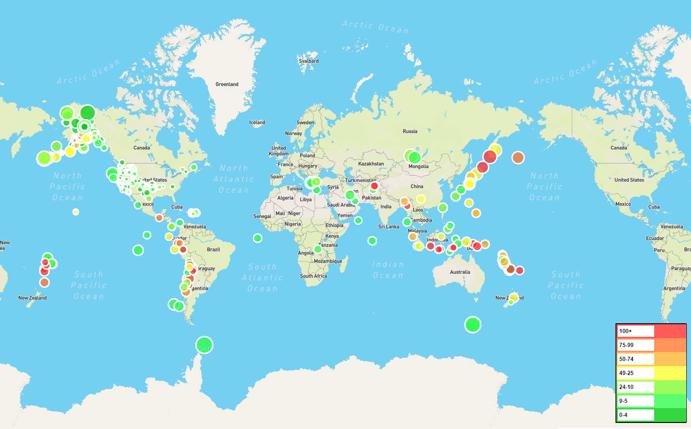

# leaflet-challenge  
## Part 1 Basic Visualization of Earthquake Data  
- Retrieve data from USGS GeoJSON Feed  
- Create a map using Leaflet that plots earthquakes from data set based on their longitude and latitude   
    - Data markers reflect magnitude of the earthquake by their size
    - Data markers reflect depth of the earthquake by their color from red(deepest) to green(shallowest)  
    -  Included popups that provide location and magnitude data  
    -  Legend reflects depth data  

## Part 2 More Data - Adding Tectonic Plates    
-  Plot second data set to illustrate the relationship between tectonic plates and seismic activity  
-  Retrieve second data set of tectonic plates  
-  Add base maps to choose from and clickable data sets (earthquakes, tectonic plates)  
-  Add control layers to map  
